# 测试用例评估报告

本报告旨在评估智能家居对话管理系统测试用例的质量，重点关注测试用例与业务需求的关联度、设计的正确性与有效性、区分度以及对业务场景的覆盖程度。

## 1. 业务需求分析

根据 `README.md` 文件，系统的核心业务需求可归纳如下：

*   **核心功能：**
    *   多轮对话状态管理和会话跟踪
    *   基于正则表达式和上下文的混合意图识别
    *   设备、动作、数值等实体类型抽取
    *   基于大语言模型（LLM）的低置信度意图澄清机制
    *   通过 SQLite 持久化存储用户偏好和对话历史
    *   提供 Streamlit 调试监控界面
    *   API 调用统计和性能监控
    *   错误处理和降级策略

*   **核心组件：**
    *   `dialogue_manager.engine.py`: 对话引擎
    *   `dialogue_manager.intent.py`: 意图识别器
    *   `dialogue_manager.memory.py`: 记忆管理器
    *   `dialogue_manager.api_client.py`: API 客户端
    *   `dialogue_manager.clarification.py`: 澄清代理

## 2. 测试用例分析

`tests/test_unit.py` 文件包含了针对系统各个核心组件的单元测试。

### 2.1. `IntentRecognizer` (意图识别器)

*   `test_intent_device_control_entities`: 测试设备控制意图及实体抽取。
*   `test_intent_greeting`: 测试问候意图。
*   `test_intent_query_no_clarification`: 测试无澄清的状态查询意图。
*   `test_intent_recognizer_edge_cases`: 测试边界情况（空输入、长输入、特殊字符）。
*   `test_intent_recognizer_with_context`: 测试带上下文的意图识别。
*   `test_intent_recognizer_with_history`: 测试带历史记录的意图识别。

### 2.2. `ClarificationAgent` (澄清代理)

*   `test_clarification_high_confidence`: 测试高置信度下的澄清。
*   `test_clarification_timeout_fallback`: 测试API超时后的降级处理。
*   `test_clarification_low_confidence_with_candidates`: 测试低置信度下的候选生成。
*   `test_clarification_empty_context`: 测试空上下文的澄清。
*   `test_clarification_with_history`: 测试带历史记录的澄清。
*   `test_clarification_api_failure_fallback`: 测试API失败时的降级处理。

### 2.3. `DialogueEngine` (对话引擎)

*   `test_engine_process_input_basic`: 测试基本的输入处理流程。
*   `test_engine_start_session`: 测试会话启动。
*   `test_engine_end_session`: 测试会话结束。
*   `test_engine_state_transitions`: 测试状态转换。
*   `test_engine_process_input_without_session`: 测试未启动会话时处理输入。
*   `test_engine_process_input_greeting`: 测试处理问候语。
*   `test_engine_process_input_query_status`: 测试处理状态查询。
*   `test_engine_process_input_ambiguous`: 测试处理模糊输入。
*   `test_engine_context_management`: 测试上下文管理。
*   `test_engine_error_handling`: 测试错误处理。
*   `test_engine_dialogue_history_management`: 测试对话历史管理。

### 2.4. `SiliconFlowClient` (API 客户端)

*   覆盖了初始化、成功请求、空消息、无效消息、HTTP 错误、速率限制重试、超时重试、服务器错误重试、超出最大重试次数、连接错误和 JSON 解析错误等场景。

### 2.5. `MemoryManager` (记忆管理器)

*   覆盖了初始化、用户档案的增删改查、会话的保存与加载、对话记录的保存与加载、会话模式、上下文加载以及旧会话清理等功能。

## 3. 测试用例与业务场景映射

```mermaid
graph TD
    subgraph Business_Requirements [业务需求]
        A[多轮对话管理]
        B[意图识别与实体抽取]
        C[智能澄清]
        D[持久化存储]
        E[API客户端]
        F[错误处理与降级]
    end

    subgraph Test_Cases [测试用例]
        subgraph Engine_Tests [DialogueEngine]
            T_Engine_Basic("test_engine_process_input_basic")
            T_Engine_Context("test_engine_context_management")
            T_Engine_History("test_engine_dialogue_history_management")
        end
        subgraph Intent_Tests [IntentRecognizer]
            T_Intent_Device("test_intent_device_control_entities")
            T_Intent_Context("test_intent_recognizer_with_context")
        end
        subgraph Clarification_Tests [ClarificationAgent]
            T_Clarify_High("test_clarification_high_confidence")
            T_Clarify_Low("test_clarification_low_confidence_with_candidates")
        end
        subgraph Memory_Tests [MemoryManager]
            T_Memory_User("test_memory_manager_save_and_load_user_profile")
            T_Memory_Session("test_memory_manager_save_and_load_session")
        end
        subgraph API_Client_Tests [SiliconFlowClient]
            T_API_Success("test_chat_completion_success")
            T_API_Retry("test_chat_completion_rate_limit_retry")
        end
        subgraph Error_Handling_Tests [错误处理]
            T_Engine_Error("test_engine_error_handling")
            T_API_Error("test_chat_completion_http_error")
            T_Clarify_Fallback("test_clarification_timeout_fallback")
        end
    end

    A --> T_Engine_Basic
    A --> T_Engine_Context
    A --> T_Engine_History
    B --> T_Intent_Device
    B --> T_Intent_Context
    C --> T_Clarify_High
    C --> T_Clarify_Low
    D --> T_Memory_User
    D --> T_Memory_Session
    E --> T_API_Success
    E --> T_API_Retry
    F --> T_Engine_Error
    F --> T_API_Error
    F --> T_Clarify_Fallback
```



## 4. 评估

### 4.1. 关联度

测试用例与 `README.md` 中定义的业务需求高度相关。每个核心组件和功能都有对应的测试用例进行验证。

### 4.2. 正确性与有效性

*   **优点**:
    *   测试用例设计合理，覆盖了正常和异常场景。
    *   使用了 `mock` 和 `patch` 来隔离外部依赖（如 API 和数据库），保证了单元测试的独立性和稳定性。
    *   对 `SiliconFlowClient` 的测试非常全面，覆盖了各种网络和API错误情况。
*   **关键测试点**:
    *   **意图识别**: 核心逻辑在于正则表达式和上下文的结合，测试用例覆盖了这两种情况。
    *   **澄清机制**: 重点测试了高/低置信度下的不同处理逻辑，以及API调用失败时的降级策略。
    *   **上下文管理**: `test_engine_context_management` 明确验证了引擎是否能利用上一轮对话的信息。
    *   **持久化**: `MemoryManager` 的测试验证了数据库的读写操作。

### 4.3. 区分度

测试用例之间有良好的区分度，每个测试用例都聚焦于一个特定的功能点或场景。例如，`test_clarification_high_confidence` 和 `test_clarification_low_confidence_with_candidates` 分别测试了澄清代理在不同置信度下的行为。

### 4.4. 覆盖程度

*   **优点**:
    *   对 `SiliconFlowClient` 和 `MemoryManager` 的覆盖比较全面。
    *   `DialogueEngine` 的核心流程（如输入处理、状态转换、上下文管理）都有测试覆盖。
*   **待改进**:
    *   **意图识别**:
        *   当前的测试主要集中在 “设备控制” 和 “状态查询” 等少数几个意图上。可以增加更多意图的测试用例，例如 `README.md` 中提到的 `QUERY_WEATHER` 等。
        *   可以增加对实体抽取更复杂的测试，例如一句话中包含多个设备或动作。
    *   **多轮对话**:
        *   当前的测试多为一到两轮的交互。可以设计更长、更复杂的多轮对话场景，以测试系统在长对话中的表现，例如连续进行设备控制、查询、再控制的场景。
    *   **Streamlit UI**:
        *   目前没有针对 `ui/app.py` 的测试。虽然 UI 测试比较复杂，但可以考虑添加一些简单的测试来确保应用能够正常启动。

## 5. 改进建议和优化方案

1.  **增加意图多样性测试**:
    *   在 `tests/test_unit.py` 中为 `intent.py` 中定义的每一种意图都添加相应的测试用例。
    *   **示例**:
        ```python
        def test_intent_query_weather(intent_recognizer):
            result = intent_recognizer.recognize("今天北京天气怎么样", context={}, history=[])
            assert result["intent"] == "query_weather"
            assert "北京" in [e["value"] for e in result["entities"] if e["entity_type"] == "location"]
        ```

2.  **增强多轮对话测试**:
    *   创建一个新的测试文件 `tests/test_integration.py`，用于更接近真实场景的集成测试。
    *   在集成测试中，模拟一个完整的用户会话，包含多个意图和上下文切换。
    *   **示例**:
        ```python
        def test_multi_turn_scenario():
            engine = DialogueEngine(api_key="test")
            # ... mock dependencies ...

            # Turn 1: Greeting
            resp1, _ = engine.process_input("你好")
            assert "你好" in resp1

            # Turn 2: Device Control
            resp2, _ = engine.process_input("打开客厅的灯")
            assert "已为您打开" in resp2

            # Turn 3: Query Status (with context)
            resp3, _ = engine.process_input("它现在亮着吗？")
            assert "是的" in resp3 # or similar affirmative response

            # Turn 4: Ambiguous input requiring clarification
            resp4, debug4 = engine.process_input("把它关了")
            assert "已为您关闭" in resp4
            assert "灯" in debug4["intent_result"]["entities"][0]["value"]
        ```

3.  **引入集成测试**:
    *   目前的测试都是单元测试。建议增加集成测试，在不（或少量）mock 依赖的情况下，测试 `DialogueEngine` 与 `IntentRecognizer`, `ClarificationAgent`, `MemoryManager` 之间的交互。

4.  **考虑UI测试**:
    *   可以研究使用 `pytest-qt` 或 `selenium` 等工具，为 `ui/app.py` 添加基本的冒烟测试，确保应用可以成功渲染主页面。